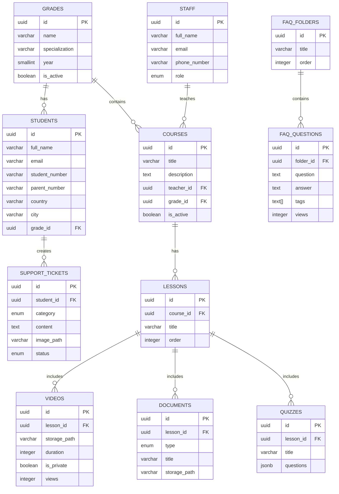

# Entity Relations Diagram

```mermaid
erDiagram
    GRADES ||--o{ STUDENTS : "has"
    GRADES ||--o{ COURSES : "contains"
    STAFF ||--o{ COURSES : "teaches"
    COURSES ||--o{ LESSONS : "has"
    LESSONS ||--o{ VIDEOS : "includes"
    LESSONS ||--o{ DOCUMENTS : "includes"
    LESSONS ||--o{ QUIZZES : "includes"
    STUDENTS ||--o{ SUPPORT_TICKETS : "creates"
    FAQ_FOLDERS ||--o{ FAQ_QUESTIONS : "contains"

    GRADES {
        uuid id PK
        varchar name
        varchar specialization
        smallint year
        boolean is_active
    }

    STUDENTS {
        uuid id PK
        varchar full_name
        varchar email
        varchar student_number
        varchar parent_number
        varchar country
        varchar city
        uuid grade_id FK
    }

    STAFF {
        uuid id PK
        varchar full_name
        varchar email
        varchar phone_number
        enum role
    }

    COURSES {
        uuid id PK
        varchar title
        text description
        uuid teacher_id FK
        uuid grade_id FK
        boolean is_active
    }

    LESSONS {
        uuid id PK
        uuid course_id FK
        varchar title
        integer order
    }

    VIDEOS {
        uuid id PK
        uuid lesson_id FK
        varchar storage_path
        integer duration
        boolean is_private
        integer views
    }

    DOCUMENTS {
        uuid id PK
        uuid lesson_id FK
        enum type
        varchar title
        varchar storage_path
    }

    QUIZZES {
        uuid id PK
        uuid lesson_id FK
        varchar title
        jsonb questions
    }

    SUPPORT_TICKETS {
        uuid id PK
        uuid student_id FK
        enum category
        text content
        varchar image_path
        enum status
    }

    FAQ_FOLDERS {
        uuid id PK
        varchar title
        integer order
    }

    FAQ_QUESTIONS {
        uuid id PK
        uuid folder_id FK
        text question
        text answer
        text[] tags
        integer views
    }
```
