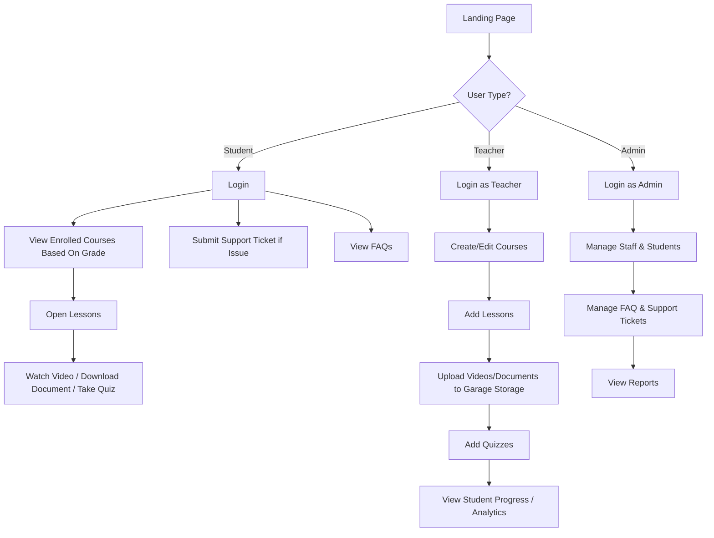

# User Flow Diagram

```mermaid
flowchart TD

A[Landing Page] --> B{User Type?}

B -->|Student| S1[Login]
S1 --> S2[View Enrolled Courses Based On Grade]
S2 --> S3[Open Lessons]
S3 --> S4[Watch Video / Download Document / Take Quiz]
S1 --> S5[Submit Support Ticket if Issue]
S1 --> S6[View FAQs]


B -->|Teacher| T1[Login as Teacher]
T1 --> T2[Create/Edit Courses]
T2 --> T3[Add Lessons]
T3 --> T4[Upload Videos/Documents to Garage Storage]
T4 --> T5[Add Quizzes]
T5 --> T6[View Student Progress / Analytics]

B -->|Admin| A1[Login as Admin]
A1 --> A2[Manage Staff & Students]
A2 --> A3[Manage FAQ & Support Tickets]
A3 --> A4[View Reports]
```
